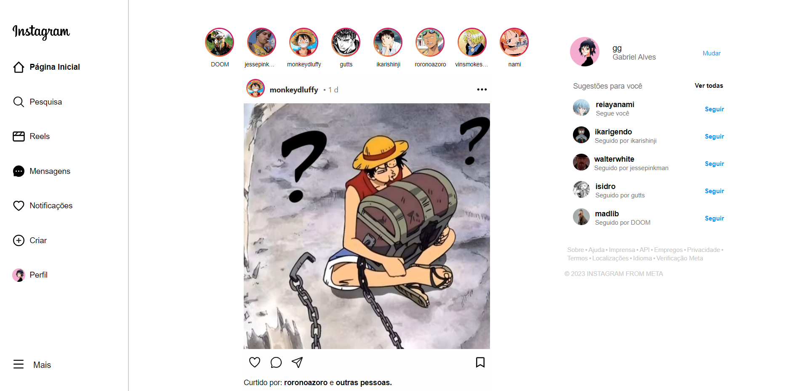

# Clone do Instagram
Olá! Bem vindo ao repositório do meu projeto de clone do instagram, uma atividade proposta pelo professor Gabriel Augusto no Instituto PROA.

## Sobre o projeto


### Descrição do projeto
Nesse projeto, deviamos criar um clone o mais visualmente parecido com a rede social Instagram, e as postagens deviam ser feitas por personagens que gostamos com o que acreditamos ser o maior desejo deles.

### Construção do projeto
Para a realização do projeto, foram utilizados: HTML, CSS e JavaScript no framework REACT.

<div style='{display:flex}'>
  <a href='https://developer.mozilla.org/pt-BR/docs/Web/HTML' target='_blank'>
    
  </a>
  <a href='https://developer.mozilla.org/pt-BR/docs/Web/CSS' target='_blank'>
    
  </a>
  <a href='https://developer.mozilla.org/pt-BR/docs/Web/JavaScript' target='_blank'>
    
  </a>
  <a href='https://react.dev/' target='_blank'>
    
  </a>
</div>

## Como acessar o projeto?

### Aessando pelo navegador

Acesse o link:
  ```sh
  https://clone-instagarm-4lvesgabriel.vercel.app/
  ```

### Acessando pelo computador

### Pré-requisitos

Para navegar no projeto no seu computador, é preciso ter instalado:

1. Visual Studio Code (ou um programa para editar códigos de sua preferência)
2. Node.js

* Visual Studio Code
  ```sh
  https://code.visualstudio.com/Download
  ```

* Node.js
  ```sh
  https://nodejs.org/en/download
  ```

### Instalação

1. Baixe o respositório
2. Abra a pasta 'clone-instagram' com o VIsual Studio Code
3. Crie um terminal e digite 'npm install' para instalar os módulos do projeto
4. Digite 'npm start' no terminal
5. Segure a tecla 'ALT' no seu teclado e clique com o botão esquerdo no link 'localhost'

